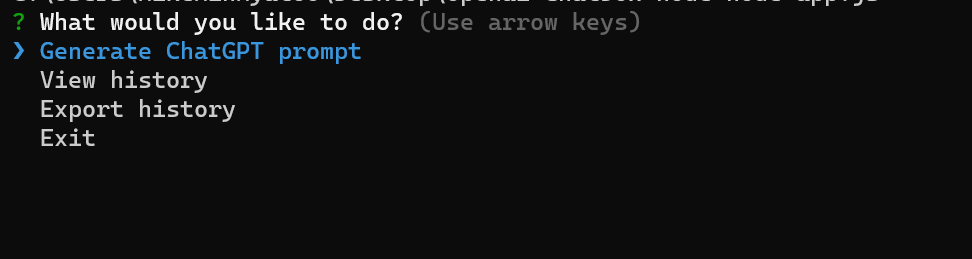

# OpenAI Chatbox

This application allows you to interact with OpenAI's ChatGPT API and store the conversation history. You can view and export the history in different formats (CSV and TXT).

## Features
- Generate ChatGPT prompts
- View conversation history
- Export conversation history in CSV and TXT formats

## Prerequisites
You need to have Node.js installed on your machine.

## Installation
1. Clone the repository or download the source code.
2. Navigate to the project directory and run `npm install` to install the required dependencies.

## Usage
1. Run the application using the command node index.js.
2. Select the desired action from the list:
   - Generate ChatGPT prompt: Enter a prompt and receive a response from the ChatGPT API.
   - View history: Browse the conversation history.
   - Export history: Export the conversation history in CSV or TXT format.
   - Exit: Close the application.
3. Follow the prompts to interact with the ChatGPT API and manage your conversation history.

## Dependencies
- axios: A promise-based HTTP client for making requests.
- inquirer: A collection of common interactive command line user interfaces.
- fs: A built-in Node.js module that provides file system-related functionalities.

Note: Please replace the apiKey value in the settings object with your own OpenAI API key.
