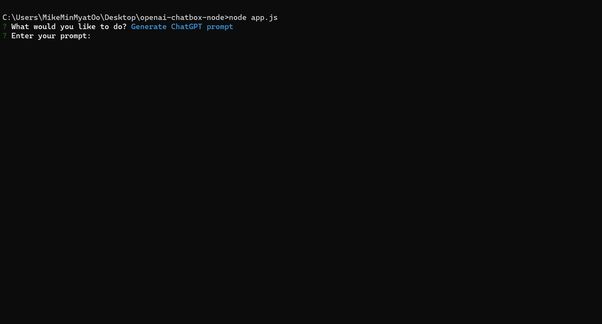

🤖 **OpenAI Chatbox** 📦

Unlock the potential of this application to engage with OpenAI's ChatGPT API while preserving your conversation history. You can effortlessly access and export your chat logs in various formats, including CSV and TXT. 🚀📋

## Features 🌟
- Generate ChatGPT prompts
- View your conversation history
- Export your conversation history in CSV and TXT formats

## Prerequisites 🛠️
Ensure you have Node.js installed on your machine.

## Installation 📦
1. Clone this repository or download the source code.
2. Navigate to the project directory and execute `npm install` to install the necessary dependencies.

## Usage 📝
1. Launch the application with the command `node index.js`.
2. Choose from the following actions:
   - Generate ChatGPT prompt: Input a prompt and receive a response from the ChatGPT API.
   - View history: Browse through your conversation history.
   - Export history: Save your conversation history in CSV or TXT format.
   - Exit: Close the application.
3. Follow the prompts to interact with the ChatGPT API and manage your conversation history.

## Dependencies 📦
- axios: A promise-based HTTP client for making requests.
- inquirer: A collection of common interactive command-line user interfaces.
- fs: A built-in Node.js module that provides file system-related functionalities.

Note: Please replace the apiKey value in the settings object with your own OpenAI API key. 🗝️
